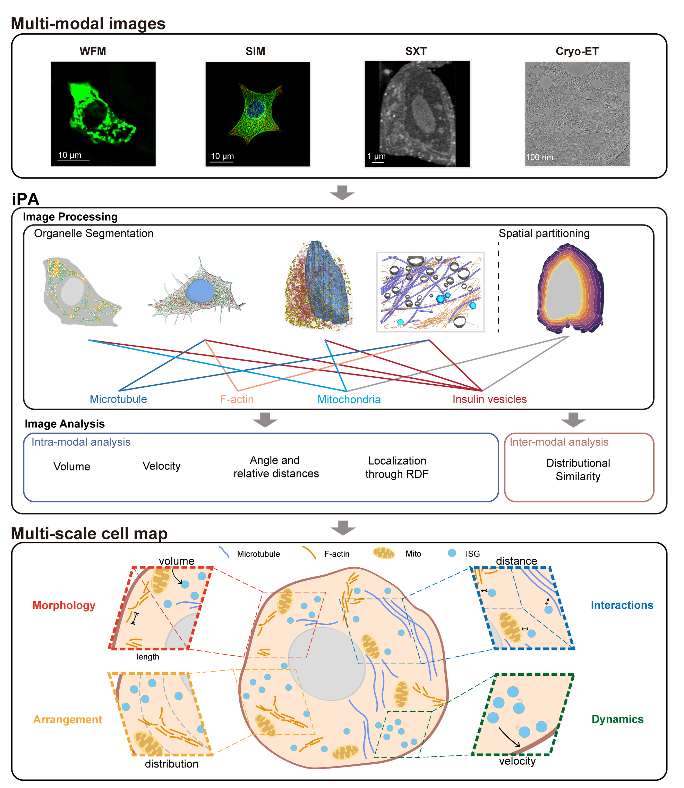

# Integrated Processing and Analysis Toolkit (iPA)

---

```shell
​**​*​**​*​**​*​**​*​**​*​**​*​**​*​**​**​**​**​
*    ██╗ ██████╗   █████╗     *
*    ██║ ██╔══██╗ ██╔══██╗    *
*    ██║ ██████╔╝ ███████║    *
*    ██║ ██╔═══╝  ██╔══██║    *
*    ██║ ██║      ██║  ██║    *
*    ╚═╝ ╚═╝      ╚═╝  ╚═╝    *
​**​*​**​*​**​*​**​*​**​*​**​*​**​*​**​**​**​**​
```
---

Developed by [Angdi] (liad@shanghaitech.edu.cn)


## Introduction

iPA is an open-source Python platform for comprehensive analysis of cellular and subcellular imaging data. Our toolkit streamlines the workflow from raw image processing to advanced quantitative analysis, enabling researchers to extract biologically meaningful features from diverse microscopy modalities.

**Key Innovations:**
- **Radial Cytoplasmic Partitioning**: Novel spatial zoning from nucleus to membrane
- **Multi-Modal Integration**: Unified analysis across imaging techniques
- **Dynamics Quantification**: Track organelle morphology, distribution and interactions
- **Cross-Modal Validation**: Compare findings between different imaging platforms



<center>iPA Analysis Pipeline</center>


## Installation

### Requirements
- Python 3.8+
- OpenCL-compatible GPU recommended
<!-- - 8GB+ RAM (16GB recommended for large datasets) -->


### Quick Setup
<!-- ```bash
# Create conda environment
conda create -n ipa python=3.9
conda activate ipa

# Install core dependencies
pip install ipa-toolkit[full]

# Install optional bioformats support
conda install -c ome bioformats_pyjvm
``` -->


## Core Features

### 1. Image Processing
| Module          | Functionality                          | Supported Modalities          |
|-----------------|----------------------------------------|--------------------------------|
| Organelle Segmentation     | Membrane/Nucleus/MT segmentation       | SIM, SXT, Cryo-ET              |
| Spatial Partition | Radial cytoplasmic zoning             | 2D/3D fluorescence imaging     |


### 2. Image Analysis
**Intra-Modal Features**:
- Volume/Surface metrics
- Spatial localization patterns
- Velocity vector fields
- Angular distributions
- Nearest-neighbor distances

**Inter-Modal Analysis**:
- Distribution similarity


## Demo


### Basic Processing Pipeline


### Advanced Multi-Modal Analysis
```python
# Compare SIM and SXT datasets
analyzer = Analyzer(
    modality_a="results/SIM_processed/", 
    modality_b="results/SXT_processed/"
)

# Calculate spatial distribution similarity
similarity_matrix = analyzer.compare_distributions(
    feature="insulin_vesicles",
    metric="wasserstein"
)

# Generate cross-modal correlation plot
analyzer.plot_correlation(
    feature="mitochondria_volume",
    save_path="plots/xcorr_mito_volume.png"
)
```

## Application Gallery

### Case Study: Glucose-Stimulated Insulin Secretion


## Citation
<!-- 
```bibtex
@article{iPA2023,
  title={Integrated Processing and Analysis Toolkit for Multi-Scale Cellular Imaging},
  author={Researcher, A. et al.},
  journal={Nature Methods},
  year={2023},
  doi={10.1038/s41592-023-01987-9}
}
```
 -->
---


For detailed documentation and tutorials, visit our documentation site.

