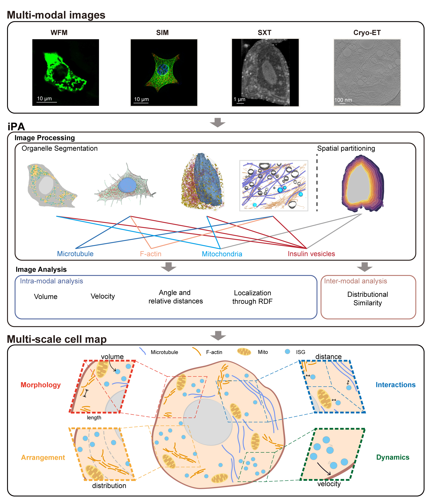

# Integrated Processing and Analysis Toolkit (iPA)

<div align="center">

```
​**​*​**​*​**​*​**​*​**​*​**​*​**​*​**​**​**​**​
*    ██╗ ██████╗   █████╗     *
*    ██║ ██╔══██╗ ██╔══██╗    *
*    ██║ ██████╔╝ ███████║    *
*    ██║ ██╔═══╝  ██╔══██║    *
*    ██║ ██║      ██║  ██║    *
*    ╚═╝ ╚═╝      ╚═╝  ╚═╝    *
​**​*​**​*​**​*​**​*​**​*​**​*​**​*​**​**​**​**​
```


**A comprehensive toolkit for multi-modal cellular imaging analysis**
[](https://www.python.org/)
[](LICENSE)
[](docs/)

</div>

---

**Developed by:** Angdi Li ([liad@shanghaitech.edu.cn](mailto:liad@shanghaitech.edu.cn))  
**Institution:** ShanghaiTech University


## Introduction

iPA is an open-source Python platform for comprehensive analysis of cellular and subcellular imaging data. Our toolkit streamlines the workflow from raw image processing to advanced quantitative analysis, enabling researchers to extract biologically meaningful features from diverse microscopy modalities.


For detailed documentation, tutorials, and examples, please visit:  
[Documentation on ReadTheDocs](https://ipa.readthedocs.io/en/latest/)

---

#### Dependencies

* numpy
* scipy
* pandas
* matplotlib
* scikit-image
* tifffile
* Pillow
* opencv-python
* mrcfile
* plotly
* seaborn
* torch
* torchvision
* tensorflow
* tqdm
* h5py
* scikit-learn
* readlif
* czifile
* nd2reader
* aicsimageio
* imageio
* wandb

---

#### Example data
* Example data are available from: [Zenodo Dataset](https://zenodo.org/records/17137083)   

* After downloading, unzip all datasets into the `data/` directory at the project root. The structure should be as follows:

* Four datasets are required for this project: cryoET, sim_images, sxt_images, and wfm_images.

* 1. Download all files for each dataset from Zenodo:
   - **cryoET dataset**: Due to size limitations, this dataset is split into three parts: `cryoET.zip.001`, `cryoET.zip.002`, `cryoET.zip.003`. **You must download all three parts together** to properly reconstruct the complete dataset.
   - **Other datasets**: `sim_images.zip`, `sxt_images.zip`, `wfm_images.zip` are single zip files that can be downloaded individually.

* 2. Create a folder named `data` in the project root directory:
  
  ```bash
  mkdir data
  ```

* 3. **For cryoET dataset** (split archive):
    * Download all three parts (`cryoET.zip.001`, `cryoET.zip.002`, `cryoET.zip.003`) to the same directory.
    * Merge the split archive into a single zip file:
      
      ```bash
      # On Linux/macOS:
      cat cryoET.zip.* > cryoET.zip
      
      # Or using zip command (all parts must be in the same directory):
      zip -s 0 cryoET.zip.001 --out cryoET.zip
      # Note: This command will automatically use all parts (.001, .002, .003)
      ```
      
    * Extract the merged zip file:
      
      ```bash
      unzip cryoET.zip -d data/
      ```

* 4. **For other datasets** (single files):
    * Simply extract each zip file directly into the `data` folder:
      
      ```bash
      unzip sim_images.zip -d data/
      unzip sxt_images.zip -d data/
      unzip wfm_images.zip -d data/
      ```

* After extraction, the directory structure should be:

```text
iPA/
├── data/             # <- All unzipped subfolders and data should be here
│   ├── cryoET/
│   ├── sim_images/
│   ├── sxt_images/
│   └── wfm_images/
├── ipa/
├── examples/
├── README.md
└── ...
```


### Overview




*Figure 1: iPA Analysis Pipeline Overview*


#### Install from local source

**Requirements:** Python 3.8-3.11 (Python 3.9 recommended)

```bash
# Create conda environment with Python 3.9 (recommended)
# Supported versions: 3.8, 3.9, 3.10, 3.11
conda create -n ipa_env python=3.9
conda activate ipa_env

# Install Git LFS (if not already installed)
# On Ubuntu/Debian:
sudo apt install git-lfs
# On macOS:
brew install git-lfs
# On Windows: download from https://git-lfs.github.io/

# Initialize Git LFS
git lfs install

# Clone the repository
git clone https://github.com/SunLab-SH/iPA.git
cd iPA

# Pull large files (including .pth model files)
git lfs pull

# Install dependencies and the package
pip install -r requirements.txt
pip install -e .
```

#### Verify Installation

Test that iPA is correctly installed and compatible with your Python version:

```bash
# Run compatibility test
python test_python_compatibility.py

# This will check:
# - Python version compatibility (3.8-3.11)
# - All required dependencies
# - Core module imports
# - Key API components
```

For developers: Test across multiple Python versions:

```bash
# Windows (PowerShell)
.\test_all_python_versions.ps1

# Linux/macOS
bash test_all_python_versions.sh

# This will create temporary conda environments for Python 3.8, 3.9, 3.10, 3.11
# and run tests in each environment.
```


<!-- ## Citation

If you use iPA in your research, please cite:

```bibtex
@software{iPA2024,
  title={Integrated Processing and Analysis Toolkit for Multi-Scale Cellular Imaging},
  author={Li, Angdi and others},
  year={2024},
  url={https://github.com/SunLab-SH/iPA}
}
``` -->