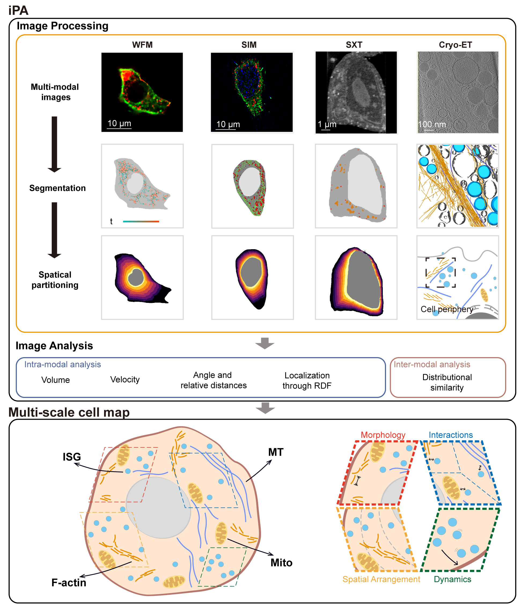

# Integrated Processing and Analysis Toolkit (iPA)

<div align="center">

```
​**​*​**​*​**​*​**​*​**​*​**​*​**​*​**​**​**​**​
*    ██╗ ██████╗   █████╗     *
*    ██║ ██╔══██╗ ██╔══██╗    *
*    ██║ ██████╔╝ ███████║    *
*    ██║ ██╔═══╝  ██╔══██║    *
*    ██║ ██║      ██║  ██║    *
*    ╚═╝ ╚═╝      ╚═╝  ╚═╝    *
​**​*​**​*​**​*​**​*​**​*​**​*​**​*​**​**​**​**​
```


**A comprehensive toolkit for multi-modal cellular imaging analysis**
[](https://www.python.org/)
[](LICENSE)
[](docs/)

</div>

---

**Developed by:** Angdi Li ([liad@shanghaitech.edu.cn](mailto:liad@shanghaitech.edu.cn))  
**Institution:** ShanghaiTech University


## Introduction

iPA is an open-source Python platform for comprehensive analysis of cellular and subcellular imaging data. Our toolkit streamlines the workflow from raw image processing to advanced quantitative analysis, enabling researchers to extract biologically meaningful features from diverse microscopy modalities.


For detailed documentation, tutorials, and examples, please visit:  
[Documentation on ReadTheDocs](https://ipa.readthedocs.io/en/latest/)

---

## Quick Start

### 1. Installation

```bash
# Clone the repository
git clone https://github.com/your-username/iPA.git
cd iPA

# Install dependencies
pip install -r requirements.txt

# Install iPA in development mode
pip install -e .
```

### 2. Download Data and Models

iPA requires data files and pre-trained models that are not included in the Git repository due to their size. Use the provided setup script to download them:

```bash
# Check what files are missing
python setup_data_and_models.py --check-only

# Download all required files
python setup_data_and_models.py

# Or download only specific types
python setup_data_and_models.py --data-only    # Only data files
python setup_data_and_models.py --models-only  # Only model files
```

**Note**: You need to configure the download URLs in `setup_data_and_models.py` with your actual file hosting service (e.g., Google Drive, Dropbox, institutional server).

### 3. Run Examples

```bash
# Cryo-ET filament segmentation
python examples/examples_et/demo_cryoET_filament_predict.py

# SXT cell analysis
python examples/examples_sxt/demo_SXT_composite_mask.py

# SIM ISG segmentation
python examples/examples_sim_wfm/demo_SIM_isg_segmentation.py
```

All example scripts are located in the `examples/` directory, organized by imaging modality.

---

#### Dependencies

* numpy
* scipy
* pandas
* matplotlib
* scikit-image
* tifffile
* Pillow
* opencv-python
* mrcfile
* plotly
* seaborn
* torch
* torchvision
* tensorflow
* tqdm
* h5py
* scikit-learn
* readlif
* czifile
* nd2reader
* aicsimageio
* imageio
* wandb

---

#### Example data
* Example data are available from: [Zenodo Dataset](https://zenodo.org/records/19903896)   

* After downloading, unzip the dataset into the `data/` directory at the project root. The structure should be as follows:

* 1. Download the data archive from Zenodo:
   - **Complete dataset**: `data.zip` contains all example data needed for demos

* 2. Create a folder named `data` in the project root directory:
  
  ```bash
  mkdir -p data
  ```

* 3. Extract the zip file into the `data` folder:
    
    ```bash
    unzip data.zip -d data/
    ```

* After extraction, the directory structure should be:

```text
iPA/
├── data/             # <- All unzipped subfolders and data should be here
│   ├── cryoET/       # Cryo-ET analysis data
│   ├── sxt/          # SXT images + labels
│   ├── sim/          # SIM images + masks
│   ├── wfm/          # WFM tracking data
│   └── other/        # Additional fluorescence references
├── ipa/
├── examples/
├── README.md
└── ...
```

**Note on Compressed Files**: Some large files (e.g., `.mrc`, `.tif`) are stored in gzip/zlib compressed formats to save space. The iPA `UniversalDataLoader` automatically detects and transparently decompresses these files during runtime. You do NOT need to manually decompress them.

**Pre-trained Models**: Model files (`.pth`) are managed via Git LFS. Please ensure you have run `git lfs pull` after cloning the repository.


### Overview




*Figure 1: iPA Analysis Pipeline Overview*


#### Install from local source

**Requirements:** Python 3.8-3.11 (Python 3.9 recommended)

```bash
# Create conda environment with Python 3.9 (recommended)
# Supported versions: 3.8, 3.9, 3.10, 3.11
conda create -n ipa_env python=3.9
conda activate ipa_env

# Install Git LFS (if not already installed)
# On Ubuntu/Debian:
sudo apt install git-lfs
# On macOS:
brew install git-lfs
# On Windows: download from https://git-lfs.github.io/

# Initialize Git LFS
git lfs install

# Clone the repository
git clone https://github.com/SunLab-SH/iPA.git
cd iPA

# Pull large files (including .pth model files)
git lfs pull

# Install dependencies and the package
pip install -r requirements.txt
pip install -e .
```

#### Verify Installation

Test that iPA is correctly installed and compatible with your Python version:

```bash
# Run compatibility test
python test_python_compatibility.py

# This will check:
# - Python version compatibility (3.8-3.11)
# - All required dependencies
# - Core module imports
# - Key API components
```

For developers: Test across multiple Python versions:

```bash
# Windows (PowerShell)
.\test_all_python_versions.ps1

# Linux/macOS
bash test_all_python_versions.sh

# This will create temporary conda environments for Python 3.8, 3.9, 3.10, 3.11
# and run tests in each environment.
```


<!-- ## Citation

If you use iPA in your research, please cite:

```bibtex
@software{iPA2024,
  title={Integrated Processing and Analysis Toolkit for Multi-Scale Cellular Imaging},
  author={Li, Angdi and others},
  year={2024},
  url={https://github.com/SunLab-SH/iPA}
}
``` -->