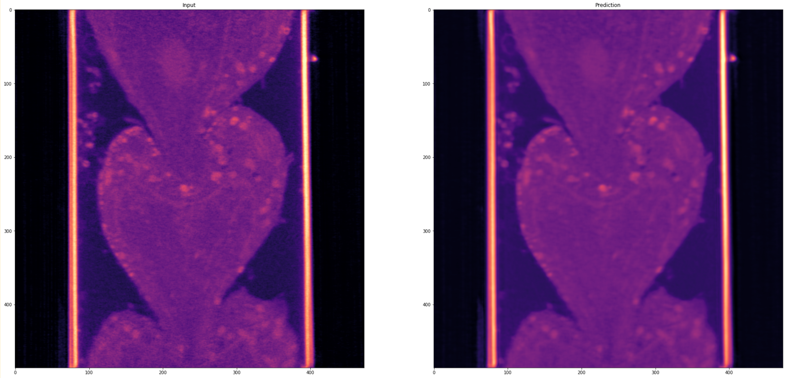

Denoising Module
================

The denoising module provides Noise2Void (N2V) based denoising capabilities for microscopy images, offering state-of-the-art self-supervised denoising without requiring clean reference images.

N2V Denoising Functions
-----------------------

**Main Denoising Function**

.. autofunction:: ipa.processing.denoising.N2V_denoise

  
**Model Loading Function**

.. autofunction:: ipa.processing.denoising.load_n2v_model

   

Features
------------

* **Self-supervised Learning**: N2V trains on noisy data without requiring clean reference images
* **3D Processing**: Optimized for volumetric microscopy data
* **Tiled Processing**: Handle large images through intelligent tiling
* **Pre-trained Models**: Ready-to-use models for common microscopy applications

Example Usage
-------------

Basic Denoising:

.. code-block:: python

    import numpy as np
    import mrcfile
    from ipa.processing.denoising import N2V_denoise
    
    # Load your noisy image
    with mrcfile.open('noisy_volume.mrc') as mrc:
        noisy_image = mrc.data
    
    # Simple denoising with auto-loaded model
    denoised_image = N2V_denoise(noisy_image)
    
    # Save result
    with mrcfile.new('denoised_volume.mrc', overwrite=True) as mrc:
        mrc.set_data(denoised_image.astype(np.float32))

Visualization:

.. code-block:: python

    import matplotlib.pyplot as plt
    
    # Visualize results (middle slice)
    slice_idx = noisy_image.shape[0] // 2
    
    plt.figure(figsize=(12, 5))
    
    plt.subplot(1, 2, 1)
    plt.imshow(noisy_image[slice_idx], cmap='magma')
    plt.title('Original (Noisy)')
    plt.colorbar()
    
    plt.subplot(1, 2, 2)
    plt.imshow(denoised_image[slice_idx], cmap='magma')
    plt.title('Denoised')
    plt.colorbar()
    
    plt.tight_layout()
    plt.show()

Usage with Custom Model:

.. code-block:: python

    from ipa.processing.denoising import load_n2v_model
    
    # Load specific pre-trained model
    model = load_n2v_model(
        model_name='n2v_3D',
        basedir='/path/to/models/'
    )
    
    # Denoise with custom tiling for large volumes
    denoised_image = N2V_denoise(
        image=noisy_image,
        model=model,
        n_tiles=(2, 4, 4)  # Adjust based on GPU memory
    )

Performance Tips
----------------

**Memory Optimization:**

* Use appropriate ``n_tiles`` parameter for large images
* Typical values: ``(1, 2, 2)`` for small volumes, ``(2, 4, 4)`` for large volumes
* Higher tiling reduces memory usage but may increase processing time

**Model Selection:**

* ``n2v_3D``: General purpose 3D denoising model
* Custom models can be loaded by specifying ``basedir`` parameter
    logger.file_in(input_file)
    
    logger.step("Performing denoising...")
    denoised_img = N2V_denoise(img)
    
    # Save results
    output_file = 'data/denoised_volume.mrc'
    os.makedirs(os.path.dirname(output_file), exist_ok=True)
    
    with mrcfile.new(output_file, overwrite=True) as mrc:
        mrc.set_data(denoised_img.astype(np.float32))
    
    logger.file_out(output_file)
    logger.step("Denoising completed successfully!")
    
    # Visualize results
    visualize_results(img, denoised_img)

Advanced Usage with Custom Model:

.. code-block:: python

    # Load specific pre-trained model
    model = load_n2v_model(
        model_name='n2v_3D',
        basedir='/path/to/models/'
    )
    
    # Denoise with custom tiling for large volumes
    denoised_image = N2V_denoise(
        image=noisy_image,
        model=model,
        n_tiles=(2, 4, 4)  # Adjust based on GPU memory
    )

