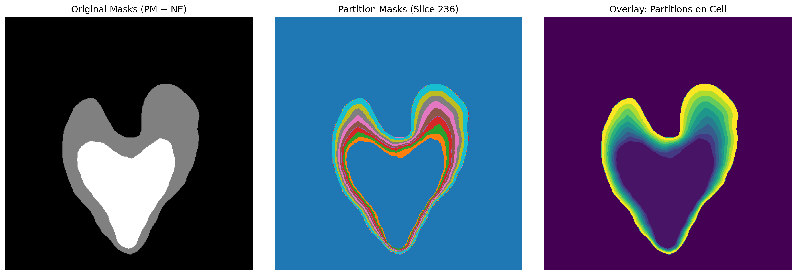

Partitioning Module
===================

Cellular space partitioning module for radial spatial analysis and visualization of intracellular membrane structures. This module focuses on spatial partitioning between nuclear envelope (NE) and plasma membrane (PM), supporting radial stratification analysis of 3D cellular volumes.

Overview
--------

Core functionalities of this module:

* **Radial Space Partitioning**: Create concentric layered regions between nuclear envelope and plasma membrane
* **Boundary Extraction**: Automatic identification and extraction of cellular membrane structure boundary points
* **Spatial Pairing**: NE-PM point mapping based on angle matching
* **3D Visualization**: Multi-level visualization tools for partitioning results

   
  
   **Figure 1**: Cellular partitioning visualization. Left: Original PM and NE masks; Middle and Right:  Show partitioning of the example cell structure, with differences in the color gradient representation.
    
Core Classes and Functions
---------------------------

Main Class
^^^^^^^^^^

.. autoclass:: ipa.processing.partitioning.Partitioning
   :no-members:    
..    :members:
..    :undoc-members:
..    :show-inheritance:

Visualization Functions
-----------------------

.. autofunction:: ipa.processing.partitioning.visualize_partitions

2D slice visualization of partitioning results:

- Support simultaneous display of multiple layers
- Customizable slice position
- Automatic color mapping and legends

Parameters:
  - **partition_list** (*list*): List of layer masks
  - **slice_idx** (*int*): Index of slice to display
  - **save_path** (*str*, optional): Save path

.. autofunction:: ipa.processing.partitioning.plot_partition_features

Layer feature statistical charts:

- Display volume distribution of each layer
- Statistical layer geometric features
- Generate quantitative analysis charts

Usage Examples
--------------

Basic Partitioning Workflow
^^^^^^^^^^^^^^^^^^^^^^^^^^^

.. code-block:: python

    from ipa.processing.partitioning import Partitioning
    from ipa.data_loader import UniversalDataLoader
    import numpy as np
    
    # 1. Initialize analyzer
    partitioner = Partitioning(
        root_dir="partition_analysis/",
        n_slices=8,
        num_cores=4
    )
    
    # 2. Load cellular membrane mask data
    ne_mask = UniversalDataLoader.load_data("nuclear_envelope.mrc")
    pm_mask = UniversalDataLoader.load_data("plasma_membrane.mrc")
    
    # 3. Extract boundary coordinates
    center, ne_edge, pm_edge = partitioner.extract_ne_pm_edges(pm_mask, ne_mask)
    print(f"Detected cell center: {center}")
    print(f"NE boundary points: {len(ne_edge)}, PM boundary points: {len(pm_edge)}")
    
    # 4. Create radial partitions
    partition_masks = partitioner.create_radial_partitions(
        ne_edge, pm_edge, ne_mask.shape
    )
    print(f"Generated {len(np.unique(partition_masks))-1} radial partitions")

Visualization examples
^^^^^^^^^^^^^^^^^^^^^^^^^^

.. code-block:: python

    from ipa.processing.partitioning import visualize_partitions, plot_partition_features
    
    # 2D slice visualization
    visualize_partitions(
        partition_list=[partition_masks == i for i in range(1, 9)],
        slice_idx=20,
        save_path="partitions_slice20.png"
    )
    
    # Layer feature analysis
    plot_partition_features(
        partition_masks,
        save_path="partition_statistics.png"
    )
    
    # Extract and save coordinate data
    partition_coords = partitioner.extract_partition_coordinates(
        partition_masks, 
        sampling_density=0.05
    )
    partitioner.save_partition_coords_to_xvg(
        partition_coords, 
        "sample_cell", 
        "output_dir/"
    )

Output Data Formats
-------------------

XVG Coordinate Files
^^^^^^^^^^^^^^^^^^^

- 3D coordinate points for each layer
- Layer index markers
- Sampling density control

